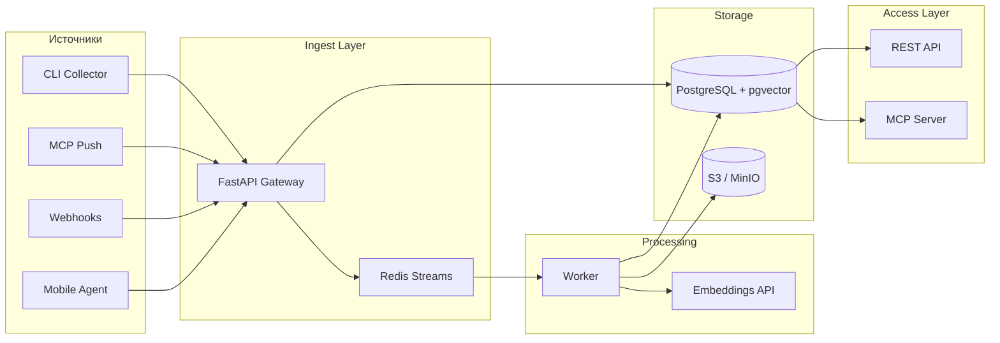

# Архитектура Mindbase

## Обзор

Mindbase — event-driven система с разделением ingest (запись) и query (чтение). Сырые данные никогда не теряются: каждый фрагмент сохраняется в immutable log (`fragments`), затем worker создаёт структурированную запись (`entries`).



## Принципы

### 1. Незаметность
- CLI: `echo "мысль" | mindbase pipe` — одна команда, без UI
- MCP: модели сами сохраняют контекст через `mindbase_remember`
- Webhook: интеграция с iOS Shortcuts, Android Tasker, n8n

### 2. Идемпотентность
Каждый фрагмент может иметь `external_id`. Повторная отправка с тем же `(source, external_id)` не создаёт дубликат.

### 3. At-least-once delivery
Redis Streams + consumer groups гарантируют, что каждый фрагмент будет обработан. Failed jobs попадают в `failed_jobs` для ручного retry.

### 4. Graceful degradation
- Без API key embeddings — keyword search через pg_trgm
- Без Redis — API всё равно пишет в PostgreSQL (worker polling fallback можно добавить)
- Health endpoint показывает состояние каждого компонента

## Модель данных

| Таблица | Назначение |
|---------|------------|
| `sources` | Регистрация источников (cli, mcp, browser...) |
| `fragments` | Immutable log сырого контекста |
| `entries` | Структурированные, searchable записи |
| `entry_links` | Граф связей между записями |
| `attachments` | Метаданные файлов в S3 |
| `failed_jobs` | Dead letter queue |

## Worker Pipeline

1. Получить `fragment_id` из Redis Stream
2. Извлечь tags (`#tag`), entities (URL, email, date)
3. Сгенерировать title, summary, importance score
4. Запросить embedding (OpenAI-compatible API)
5. Записать `entry`, пометить fragment как `done`

## Доступ для AI-моделей

### MCP (рекомендуется)
Добавьте в Cursor / Claude Desktop:

```json
{
  "mcpServers": {
    "mindbase": {
      "command": "python",
      "args": ["-m", "mindbase_mcp.server"],
      "env": {
        "MINDBASE_API_URL": "https://your-mindbase.example.com",
        "MINDBASE_API_KEY": "your-secret-key"
      }
    }
  }
}
```

### REST
- `GET /v1/context/summary` — markdown для system prompt
- `POST /v1/search` — поиск по контексту
- `POST /v1/ingest` — запись нового фрагмента

## Roadmap

- [ ] Browser extension (passive page capture)
- [ ] macOS menu bar agent (clipboard, active window)
- [ ] Voice pipeline (Whisper → fragments)
- [ ] Semantic search через pgvector (требует embedding key)
- [ ] GraphRAG по entry_links
- [ ] End-to-end encryption at rest
